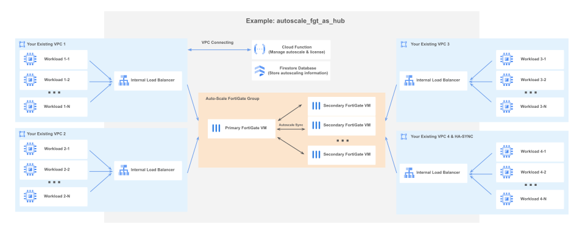

# Example: Autoscale FortiGate as Center Hub.

Utilize Autoscale FortiGate as a central hub to connect up to eight existing VPCs. FortiGates connect your VPCs and manage traffic between VPCs.

## Architecture

The "autoscale_fgt_as_hub" Terraform project contains one `Auto-Scale FortiGate Group`, one or more `Internal Load Balancer` and `Route` to the front IP of `Internal Load Balancer`. You need to provide your existing VPCs (8 at most). 
It uses `Google Cloud Function` and `Firestore Database` to designate a primary FortiGate and to manage license deployment across the FortiGates. It uses `Google Bucket Storage` to store cloud function code and license files.


**Architecture Diagram:**


The `Auto-Scale FortiGate Group` consists of dynamically scalable FortiGates, including one primary FortiGate VM and potentially multiple secondary FortiGate VMs. Configurations are set on the primary FortiGate and automatically synchronized across all secondary FortiGates. If the primary FortiGate fail, the Google Cloud Function will promote the oldest secondary FortiGate to take its place.

Each FortiGate can at most have 8 network interfaces (NICs). Each interface is connecting to your existing VPC.

You need to assign one interface for `Google Cloud Function` to communicate with your FortiGates (variable `cloud_function.cloud_func_interface`, default value is "port1"). And one interface to syncing information between FortiGates (variable `ha_sync_interface`).

## Requirements

Following Google APIs must be enabled:
- eventarc.googleapis.com
- firestore.googleapis.com # And *(default)* database in Native mode.
- storage.googleapis.com
- compute.googleapis.com
- secretmanager.googleapis.com
- pubsub.googleapis.com
- vpcaccess.googleapis.com
- cloudbuild.googleapis.com
- run.googleapis.com
- logging.googleapis.com

Firestore *"(default)"* database must be created in Native mode before using this module. The *"(default)"* database is the Firestore default database. If it does not exist, please create it manually.
```
# Using this script to create the "(default)" database.
# Please do not destroy it once it is created.
resource "google_firestore_database" "database" {
  project     = "<YOUR-PROJECT-NAME>"
  name        = "(default)"
  location_id = "nam5"     # "nam5" (United States) or "eur3" (Belgium and Netherlands)
  type        = "FIRESTORE_NATIVE"
}
```
Please do not destroy *"(default)"* database once it is created. Please do not try to delete and recreate "google_firestore_database", otherwise, an error may occur.

## How To Deploy

You can find the template in [`/examples/autoscale_fgt_as_hub/terraform.tfvars.template`](https://github.com/fortinetdev/terraform-google-cloud-modules/blob/main/examples/autoscale_fgt_as_hub/terraform.tfvars.template)


#### Project Variables:
```
project = "<YOUR-OWN-VALUE>"        # Your GCP project name.
prefix  = "fgt-hub"                 # Prefix of the objects in this example. It should be unique to avoid name conflict between examples.
region  = "<YOUR-OWN-VALUE>"        # e.g., "us-central1"
zones   = ["<YOUR-OWN-VALUE1>",     # e.g., ["us-central1-b", "us-central1-c"]. Deploy FortiGates across multiple zones.
           "<YOUR-OWN-VALUE2>"]     # If zones is empty, GCP will select 3 zones for you.

# IAM variables (Optional)
# service_account_email = "example@<your-project-name>.iam.gserviceaccount.com"
# The e-mail address of the service account. This service account will control the cloud function created by this project.
# This service account should already have "roles/datastore.user", "roles/compute.viewer" and "roles/run.invoker".
# If this variable is not specified, the default Google Compute Engine service account is used.
```
Modify these variables based on your needs.

`service_account_email` should comply with the least privilege principle.
You can [create dedicated service account by using our GCP module](https://github.com/fortinetdev/terraform-google-cloud-modules/blob/main/docs/guide_gcp_modules.md#create-dedicated-service-account).

If you want to deploy more than one examples, please make sure the `prefix` of those examples are different.


#### FortiGate Variables:
```
fgt_password = "<YOUR-OWN-VALUE>"   # Your own value (at least 8 characters), or this terraform project will create one for you. (Username is admin)
machine_type = "n1-standard-4"      # The Virtual Machine type to deploy FGT.
# fgt_hostname = "example-hostname" # The hostname of all FGTs in the autoscale group. If not specified, the FGT's hostname will be its serial number.

# FortiGate image.
# You can use "image_type" to deploy the latest public FortiGate image, or use "image_source" to deploy the custom image.
# One of the variables "image_type" and "image_source" must be provided, otherwise an error occurs.
# If both are provided, "image_source" will be used, and "image_type" will be ignored.
image_type   = "fortigate-76-byol"  # The type of public FortiGate Image.
                                    # fortigate-76-byol: bring your own licenses, you need to specify cloud_function->license_source;
                                    # fortigate-76-payg: pay as you go, you don't need to specify license_source.
# image_source = "projects/fortigcp-project-001/global/images/fortinet-fgt-760-20240726-001-w-license"  # The source of the custom image.

# Additional disk (Optional)
# additional_disk = {
#   size = 50                       # Log disk size (GB) for each FGT. If set to 0, no additional log disk is created.
#   type = "pd-standard"            # The Google Compute Engine disk type. Such as "pd-ssd", "local-ssd", "pd-balanced" or "pd-standard".
# }
```

`fgt_password` is the password for all FGTs in this project (Username is "admin"). It should be at least 8 characters. If you don't specify it, this project will create one for you. You can find `fgt_password` in the output. **After the deployment, if you change the "admin" user password elsewhere (e.g., through the GUI or CLI), please ensure you also update the password here to allow the Cloud Function to communicate with the FortiGates.**

`machine_type` represents the Virtual Machine type to deploy FGT.
Example of predefined machine type: "n1-standard-4", "n2-standard-8", ...
The value "n1-standard-4" in the template is just an example for demonstration. It may not be suitable for your task. Please change the `machine_type` to match your needs.
You can find more supported machine types [here](https://docs.fortinet.com/document/fortigate-public-cloud/7.6.0/gcp-administration-guide/304081).

The variable `image_type` and variable `image_source` are mutually exclusive, only one variable can be specified. Specify `image_type` to deploy the latest public FortiGate image, or `image_source` to use a custom image.

`image_type` represents the type of FGT image. You can use the command `gcloud compute images list --project=fortigcp-project-001 --filter="family:fortigate*" --format="table[no-heading](family)" | sort | uniq` to get all possible values.

- "fortigate-76-byol" means the FGT image is the latest patch of FGT 7.6, and you want to bring your own licenses (byol). You need to specify your FortiGate license source in `cloud_function -> license_source`.
- "fortigate-76-byol" means the FGT image is the latest patch of FGT 7.6, and you want to [pay as you go (payg)](https://console.cloud.google.com/marketplace/product/fortigcp-project-001/fortigate-payg). You don't need to specify the FortiGate license source. However, you need to pay an additional license fee in GCP based on the number of CPU cores (vCPU) of the instance.

`image_source` specifies the source of the custom image. Example value: "projects/fortigcp-project-001/global/images/fortinet-fgt-760-20240726-001-w-license"
After deploying the project, modifying this variable only affects newly created FortiGate instances. The image of existing FortiGate instances remains unchanged.

Check [here](https://github.com/fortinetdev/terraform-google-cloud-modules/blob/main/docs/guide_image.md) for more information about image.

If `additional_disk` is specified, every FGT will have its own log disk, and the initialization time will increase by 1~2 minutes.


#### Network Variables:
```
network_interfaces = [
  # Port 1 of your FortiGate. For this interface, this prject creates an internal load balancer (ILB) and a route to the ILB.
  {
    network_name  = "user1-network"        # Name of your network.
    subnet_name   = "user1-subnet"         # Name of your subnet.
    has_public_ip = true                   # Whether FortiGates in this network have public IP. Default is false.
    internal_lb = {                        # If "internal_lb" is specified, an internal load balancer will be created in the "subnet_name" subnet.
      ip_range_route_to_lb = "10.0.0.0/8"  # If "ip_range_route_to_lb" is specified, a route will be created in the "subnet_name" subnet.
                                           # And all traffic to "ip_range_route_to_lb" will be routed to the internal load balancer (ilb) in this subnet.
    }
  },
  # Port 2 of your FortiGate. For this interface, this prject creates an internal load balancer (ILB). (No route to the ILB).
  {
    network_name = "user2-network"
    subnet_name  = "user2-subnet"
    internal_lb = {}
  },
  # Port 3 of your FortiGate. No ILB and route to ILB will be created. Using existing ILB instead.
  # You need to manually add the FGT instance group as the backend of the existing ILB in Google Cloud after the deployment of this example project.
  {
    network_name = "user3-network"
    subnet_name  = "user3-subnet"
    additional_variables = {
      ilb_ip = "10.2.0.100"
    }
  },
  # Port 4 of your FortiGate. This interface doesn't specify "internal_lb", so no ILB and route to ILB will be created.
  {
    network_name = "user4-network"
    subnet_name  = "user4-subnet"
  }
]
network_tags = ["<YOUR-OWN-VALUE1>", "<YOUR-OWN-VALUE2>"]  # The list of network tags attached to FortiGates.
ha_sync_interface = "port4"                # Please make sure you at least have N interfaces specified in "network_interfaces" if you set it to "portN".
```

`network_interfaces[N].network_name` is the name of your existing VPC.

`network_interfaces[N].subnet_name` is the name of your existing subnet under the `network_name`.

`network_interfaces[N].has_public_ip` indicates whether this port has a public IP. The default is False.

`network_interfaces[N].internal_lb` is `null` or a dictionary. Its default value is `null`. If `internal_lb` is specified (`internal_lb={}`), an internal load balancer will be created under the subnet `subnet_name`.

`network_interfaces[N].internal_lb.front_end_ip` is the IP of your internal load balancer. If not specified, GCP will select an IP for you.

`network_interfaces[N].internal_lb.ip_range_route_to_lb` helps you to create a route. If it is specified, a route will be created in the subnet `subnet_name` . All traffic to `ip_range_route_to_lb` will be routed to the internal load balancer (ilb) in this subnet.

`network_interfaces[N].additional_variables.ilb_ip`. If you want to use an existing ILB, you can specify this variable without creating a new ILB. This variable will configure the FGT's interface to support ILB. **This variable does not connect the FGT instance group to your existing ILB. You need to manually add the FGT instance group as the backend of the existing ILB in Google Cloud after the deployment of this example project.**

`network_tags` is a list of network tags attached to FortiGates. GCP firewall rules have "target tags", and these firewall rules only apply to instances with the same tag. You can specify the tags here.

`ha_sync_interface` is the port used to sync data between FortiGates. Example values: "port1", "port2", "port3"...  If you specified 8 interfaces in `network_interfaces`, then the first interface is "port1", the second one is "port2", the last one is "port8".

#### Cloud Function Variables:
```
cloud_function = {
  cloud_func_interface = "port1"           # To communicate with FGTs, the Cloud Function must be connected to the VPC where FGTs also exist.
                                           # By default, this project assumes the Cloud Function connects to the first VPC you specified in "network_interfaces", and configure your FGTs through port1.
                                           # You can also set it to "port2", "port3", ..., "port8" to force the Cloud Function to connect to other VPC and communicate with your FortiGates through that port,
                                           # but you need to specify the corresponding route of FGTs in "config_script" or "config_file" so FGTs can reply to the Cloud Function requests from "cloud_function.function_ip_range".
  function_ip_range   = "192.168.8.0/28"   # Cloud function needs to have its own CIDR ip range ending with "/28", which cannot be used by other resources.
  license_source      = "file"             # The source of license if your image_type is "fortigate-xx-byol".
                                           # Possible value: "none", "fortiflex", "file", "file_fortiflex"
  license_file_folder = "./licenses"       # The folder where all ".lic" license files are located.
  autoscale_psksecret = "<RANDOM-STRING>"  # The secret key used to synchronize information between FortiGates. If not set, the module will randomly generate a 16-character secret key.
  logging_level       = "INFO"             # Verbosity of logs. Possible values include "NONE", "ERROR", "WARN", "INFO", "DEBUG", and "TRACE". You can find logs in Google Cloud Logs Explorer.
  # "fortiflex" parameters is required if license_source is "fortiflex" or "file_fortiflex"
  # fortiflex = {
  #   retrieve_mode = "use_active"           # How to retrieve an existing fortiflex license (entitlement)
  #                                          # "use_active": Retrieves "ACTIVE" or "PENDING" licenses. If the license is released, the license keeps "ACTIVE".
  #                                          # "use_stopped" (default behavior): Retrieves "STOPPED", "EXPIRED" or "PENDING" licenses, and changes them to "ACTIVE". If the license is released, change the license to "STOPPED".
  #   username      = "<YOUR-OWN-VALUE>"     # The username of your FortiFlex account.
  #   password      = "<YOUR-OWN-VALUE>"     # The password of your FortiFlex account.
  #   config        = <YOUR-OWN-VALUE>       # The config ID of your FortiFlex configuration.
  # }

  # This parameter controls the instance that runs the cloud function. For simplicity, it is recommended to use the default value.
  service_config = {
    max_instance_count               = 1    # The limit on the maximum number of function instances that may coexist at a given time.
    max_instance_request_concurrency = 3    # Sets the maximum number of concurrent requests that one cloud function can handle at the same time.
    available_cpu                    = "1"  # The number of CPUs used in a single container instance.
    available_memory                 = "1G" # The amount of memory available for a function.
    timeout_seconds                  = 420  # The function execution timeout.
  }

  # additional_variables = {}               # Additional Cloud Function Variables

  # The following parameters are optional, and no need to be specified in most of cases
  # build_service_account_email = "your-name@example.com" # The email address of the service account used to build the cloud function. This account needs to have role "roles/cloudbuild.builds.builder".
                                                          # The <PROJECT_NUMBER>@cloudbuild.gserviceaccount.com will be used if it is not specified.
  # trigger_service_account_email = "your-name@example.com" # The email address of the service account used to trigger the cloud function. This account needs to have role "roles/run.invoker".
                                                            # The default service account will be used if it is not specified.
}
```

Cloud Function is used to manage FGT synchronization and inject license into FGT. For more information about the Cloud Function, please check [here](https://github.com/fortinetdev/terraform-google-cloud-modules/blob/main/docs/guide_function.md).

`cloud_func_interface` is the interface of the FortiGates communicate with the Cloud Function. The default value is "port1".
By default, this project assumes the Cloud Function connects to the first VPC you specified in `network_interfaces`, and configure your FGTs through "port1". You can also set it to "port2", "port3", ..., "port8" to force the Cloud Function to connect to other VPC and communicate with your FortiGates through that port.
If you set `cloud_func_interface = portX` and "portX" is not the default value "port1", you need to specify
```
config_script = <<EOF
# Using following scripts to let FortiGates respond Cloud Function
# "set allowaccess https" is required for interface <portX>.
config system interface
  edit <portX>
    set allowaccess ping https ssh fgfm probe-response
  next
end
config router static
  edit 0
    set dst <vault of cloud_function.function_ip_range>
    set device <portX>
    set gateway <gateway of portX>
  next
end
EOF
```

`function_ip_range` is used by cloud function. This IP range needs to end with "/28" and cannot be used by any other resources.

`license_source` is the source of your license. If your `image_type` ends with "byol" (bring your own license), you need to specify your license source here. Possible values are
- "none": Don't inject licenses to FGTs.
- "file": Injecting licenses based on license files. All license files should be in `license_file_folder` (default value is "./licenses").
- "fortiflex": Injecting licenses based on FortiFlex. You need to specify the variable `fortiflex` if license_source is "fortiflex".
- "file_fortiflex": Injecting licenses based on license files first. If all license files are in use, try FortiFlex next.

`autoscale_psksecret` is the secret key used to synchronize information between FortiGates. If not set, this project will randomly generate a 16-character secret key. You can find it in the output.

`logging_level` is used to control the verbosity of logs. Possible values include "NONE", "ERROR", "WARN", "INFO", "DEBUG", and "TRACE". Logs can be viewed in the Google Cloud Logs Explorer. If you set logging_level to "INFO", all logs of "INFO" severity or higher ("INFO", "WARN", "ERROR") will be recorded.

`fortiflex` is required if your `license_source` is "fortiflex".
The cloud function will retrieve your existing unused FortiFlex entitlements and use them to inject licenses into FortiGates.
You need to provide your FortiFlex `username` and `password`.
You also need to provide a FortiGate configuration `config` (A digital number). You can use our fortiflexvm Terraform to [create a FortiGate configuration](https://registry.terraform.io/providers/fortinetdev/fortiflexvm/latest/docs/resources/fortiflexvm_config) and get its config ID. You need to [use this config ID to create entitlements](https://registry.terraform.io/providers/fortinetdev/fortiflexvm/latest/docs/resources/fortiflexvm_entitlements_vm) in advance.

`service_config` is a variable that controls the instance on which the cloud function runs. You can increase `max_instance_request_concurrency` to allow multiple injection license requests to run simultaneously. You need to increase `available_memory` if your `max_instance_request_concurrency` is high and running out of existing memory.

`additional_variables` specifies additional variables used by Cloud Function. Some variables are too trivial or **not recommended to be changed**. You can specify them here to overwrite the behavior of the Cloud Function for more customization.

To get advice on how to specify `additional_variables` to suit your custom needs, please create an GitHub issue at https://github.com/fortinetdev/terraform-google-cloud-modules

- "FIRESTORE_DATABASE": (default: "(default)") The Firestore database that Cloud Function used to store data.

```
cloud_function = {
    # other variables ...

    # Only set additional_variables when needed.
    additional_variables = {
      # FIRESTORE_DATABASE   = "YOUR-EXISTING-DATABASE-NAME"   # Default value is "(default)"
    }
}
```

#### Autoscaler Variables:
```
autoscaler = {
  max_instances     = 4     # The maximum number of FGT instances
  min_instances     = 2     # The minimum number of FGT instances
  cooldown_period   = 360   # Specify how long (seconds) it takes for FGT to initialize from boot time until it is ready to serve.
  cpu_utilization   = 0.8   # Autoscaling signal. If CPU utilization is above this value, Google Cloud will create new FGT instances.
  autohealing = {              # Parameters about autohealing. Autohealing recreates VM instances if your application cannot be reached by the health check.
    health_check_port = 8008   # The port used for health checks by autohealing.
    # timeout_sec = 5          # How long (in seconds) to wait before claiming a health check failure.
    # check_interval_sec = 30  # How often (in seconds) to send a health check.
    # unhealthy_threshold = 10 # A so-far healthy instance will be marked unhealthy after this many consecutive failures.
  }
  scale_in_control_sec = 300   # When the group scales down, Google Cloud will delete at most one FGT every 'scale_in_control_sec' seconds.
}
```
Autoscaler is used to control when to autoscale and control the number of FortiGate instances.

`max_instances` is the maximum number of FGT instances you want to create.

`min_instances` is the minimum number of FGT instances. Your auto-scale FortiGate Group will at least have `min_instances` FGTs. This number can not be less than 2.

`cooldown_period` specify how long (seconds) it takes for FGT to initialize from boot time until it is ready to serve. Please increase this value if the instance takes longer to become ready, especially when `additional_disk` is configured.

`cpu_utilization` is the autoscaling signal. If CPU utilization is above this value, Google Cloud will create new FGT instances. Google Cloud will also delete idle FGT instances if CPU utilization is low for a long time.

`autohealing.health_check_port` is the port used for health checks by autohealing and health checks by load balancers.

`scale_in_control_sec` can prevent the aggressive scale down. If `scale_in_control_sec` is not 0, when the group scales down, Google Cloud will delete at most one FGT every 'scale_in_control_sec' seconds. By default, its value is 300.

#### Additional FGT configuration script.

**NOTE: After deploying this terraform project, changing the variable `config_script` (and contents in `config_file`) will not change the FortiGate configuration.**

The following script is just an example: it allows all traffic between port1 and port2.

Please modify the script based on your needs.

```
config_script = <<EOF
config firewall policy
    # Allow all port2 to port1 traffic
    edit 0
        set name "port2_to_port1"
        set srcintf "port2"
        set dstintf "port1"
        set action accept
        set srcaddr "all"
        set dstaddr "all"
        set schedule "always"
        set service "ALL"
    next
    # Allow all port1 to port2 traffic
    edit 0
        set name "port1_to_port2"
        set srcintf "port1"
        set dstintf "port2"
        set action accept
        set srcaddr "all"
        set dstaddr "all"
        set schedule "always"
        set service "ALL"
    next
    # Allow all port2 to port2 traffic
    edit 0
        set name "port2_to_port2"
        set srcintf "port2"
        set dstintf "port2"
        set action accept
        set srcaddr "all"
        set dstaddr "all"
        set schedule "always"
        set service "ALL"
    next
    # Allow all port1 to port1 traffic
    edit 0
        set name "port1_to_port1"
        set srcintf "port1"
        set dstintf "port1"
        set action accept
        set srcaddr "all"
        set dstaddr "all"
        set schedule "always"
        set service "ALL"
    next
end
EOF
```

In addition to the variable config_script, you can also save the configuration script as a file and upload the script using the variable config_file.

If you specify both config_script and config_file, this terraform project will upload both of them.

#### Others
```
# FortiManager integration
fmg_integration = {
  ip = "<Your FMG IP>"             # The public IP address of the FortiManager.
  sn = "<Your FMG Serial Number>"  # The serial number of the FortiManager.
  ums = {
    autoscale_psksecret = "<RANDOM-STRING>"  # The secret key used to synchronize information between FortiGates.
    fmg_reg_password    = "fmg_reg_passwd>"  # The password used to register the FortiGate to the FortiManager.
    sync_interface      = "port1"            # The interface used to synchronize information between FortiGates.
    api_key             = ""                 # The API key used to register the FortiGate to the FortiManager. Only used when license type is BYOL.
  }
}
```


## FortiGates Licenses

To use FortiGates, you need to provide the necessary licenses. Here are the available options:

1. Set `image_type` as "fortigate-xx-payg" (e.g., "fortigate-76-payg"). With this option, you do not need to specify a separate license source, but you will be charged additional license fees in GCP based on the number of CPU cores (vCPUs) of the instance.

2. **(RECOMMENDED)** Set `image_type` as "fortigate-xx-byol" (e.g, "fortigate-76-byol"). Configure `cloud_function->license_source` as "file", and place your license files (.lic files) in the `cloud_function->->license_file_folder` folder.

3. Set `image_type` as "fortigate-xx-byol" (e.g, "fortigate-76-byol"). Configure `cloud_function->license_source` as "fortiflex" and properly set `cloud_function->fortiflex`. Use `cloud_function->fortiflex->config` to specify a digital ID of your configuration.
  - GUI method: Visit the [fortiflex platform](https://support.fortinet.com/flexvm/), create a "FortiGate Virtual Machine" configuration and generate several entitlements based on this configuration.  
  - Terraform method: You can use our fortiflexvm Terraform to [create a FortiGate configuration](https://registry.terraform.io/providers/fortinetdev/fortiflexvm/latest/docs/resources/fortiflexvm_config) and get its config ID. You need to [use this config ID to create entitlements](https://registry.terraform.io/providers/fortinetdev/fortiflexvm/latest/docs/resources/fortiflexvm_entitlements_vm) in advance.

4. Set `image_type` as "fortigate-xx-byol" (e.g, "fortigate-76-byol"). Configure `cloud_function->license_source` as "file_fortiflex". This setting prioritizes using files to inject licenses into FortiGates initially. If file licenses are depleted, it will use "fortiflex" method.

## Configure FortiGates after deploying

After deploying this terraform project, the `config_script` and contents within the `config_file` become immutable. Subsequent modifications to the `config_script` or the `config_file` will not affect the configuration of existing FortiGates.

If you specified `has_public_ip = true` in `network_interfaces[0]`, you can login your FortiGates through their public IP.

In "Google Cloud Firestore -> (default) -> \<YOUR-PROJECT-PREFIX\> -> GLOBAL", you can access the global information of this terraform project. The `"primary_ip_list"` (e.g., ["10.0.0.3", "10.1.0.3", "10.2.0.3", "10.3.0.3"]) indicates the private IPs of the primary FortiGate. The first IP is in the subnet `network_interfaces[0].subnet_name`, and the second IP is in the subnet `network_interfaces[1].subnet_name`... You can use SSH to log in to your primary FortiGate.

The default username is `"admin"`. You can get the password by using the command `terraform output fgt_password`

## Create a New VPC and Subenet

This example assumes that you already have existing VPCs and subnets. It only requires the subnet names.

If you do not have existing VPCs, you can create them using the following scripts.

```
module "example_vpc" {
  source = "fortinetdev/cloud-modules/google//modules/gcp/vpc"

  network_name = "<your-network-name>"

  subnets = [
    {
      name          = "<your-subnet-name>"             # subnet name should be unique in your GCP project.
      region        = "us-central1"                    # Region of your subnet
      ip_cidr_range = "10.0.0.0/24"                    # CIDR of your subnet
    }
  ]

  # Example firewall, you can change it based on your needs.
  firewall_rules = [
    {
      name          = "<your-firewall-name>"
      source_ranges = ["0.0.0.0/0"]
      target_tags   = ["<network-tag-name>"]           # Network tags. All GCP instances with the tag "<network-tag-name>" will follow this firewall rule.
      allow = [
        {
          protocol = "all"
        }
      ]
    }
  ]
}
```

## Others
- **Even if `terraform apply` is complete, FortiGates require time to initialize, load licenses and synchronize within the auto-scaling group, which may take 5 to 10 minutes. During this period, the FortiGates will be unavailable.**
- After deploying the project, modifying variable `image_source` only affects newly created FortiGate instances. The image of existing FortiGate instances remains unchanged.
