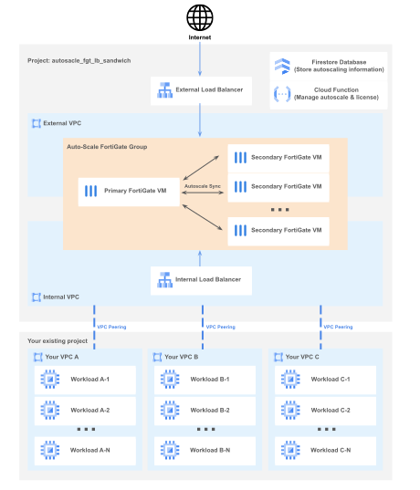

# Example: Autoscale FortiGate with Load Balancer Sandwich

Autoscale FortiGate with Load Balancer Sandwich offers a dynamically scalable network security solution that efficiently manages the traffic flowing in and out of your VPCs.

## Architecture

The "autoscale_fgt_lb_sandwich" Terraform project comprises an `Auto-Scale FortiGate Group`, two `VPCs`, an `External Load Balancer`, and an `Internal Load Balancer`. It uses `Google Cloud Function` and `Firestore Database` to designate a primary FortiGate and to manage license deployment across the FortiGates. It uses `Google Bucket Storage` to store cloud function code and license files.

**Architecture Diagram:**


The `Auto-Scale FortiGate Group` consists of dynamically scalable FortiGates, including one primary FortiGate VM and potentially multiple secondary FortiGate VMs. Configurations are set on the primary FortiGate and automatically synchronized across all secondary FortiGates. If the primary FortiGate fail, the Google Cloud Function will promote the oldest secondary FortiGate to take its place.

Each FortiGate is equipped with two network interfaces (NICs): one connects to the `External VPC` and the other to the `Internal VPC`.

Your VPCs will establish a VPC peering connection with the `Internal VPC`. All outbound traffic is then directed to the `Internal Load Balancer` and passed on to the `Auto-Scale FortiGate Group`. It is crucial that your VPCs do not retain a default route ("0.0.0.0/0") to ensure traffic is properly routed through this architecture.

The roles of `Google Cloud Function` and `Firestore Database` include selecting the primary FortiGate and administering license injections into the FortiGates.

## Requirements

Following Google APIs must be enabled:
- eventarc.googleapis.com
- firestore.googleapis.com # And *(default)* database in Native mode.
- storage.googleapis.com
- compute.googleapis.com
- secretmanager.googleapis.com
- pubsub.googleapis.com
- vpcaccess.googleapis.com
- cloudbuild.googleapis.com
- run.googleapis.com
- logging.googleapis.com

Firestore *"(default)"* database must be created in Native mode before using this module. The *"(default)"* database is the Firestore default database. If it does not exist, please create it manually.
```
# Using this script to create the "(default)" database.
# Please do not destroy it once it is created.
resource "google_firestore_database" "database" {
  project     = "<YOUR-PROJECT-NAME>"
  name        = "(default)"
  location_id = "nam5"     # "nam5" (United States) or "eur3" (Belgium and Netherlands)
  type        = "FIRESTORE_NATIVE"
}
```
Please do not destroy *"(default)"* database once it is created. Please do not try to delete and recreate "google_firestore_database", otherwise, an error may occur.

## How To Deploy

You can find the template in [`/examples/autoscale_fgt_lb_sandiwch/terraform.tfvars.template`](https://github.com/fortinetdev/terraform-google-cloud-modules/blob/main/examples/autoscale_fgt_lb_sandwich/terraform.tfvars.template)

#### Project Variables:
```
project = "<YOUR-OWN-VALUE>"        # Your GCP project name.
prefix  = "lb-sandwich"             # Prefix of the objects in this example. It should be unique to avoid name conflict between examples.
region  = "<YOUR-OWN-VALUE>"        # e.g., "us-central1"
zones   = ["<YOUR-OWN-VALUE1>",     # e.g., ["us-central1-b", "us-central1-c"]. Deploy FortiGates across multiple zones.
           "<YOUR-OWN-VALUE2>"]     # If zones is empty, GCP will select 3 zones for you.

# IAM variables (Optional)
# service_account_email = "example@example.com " # The e-mail address of the service account. 
                                                 # This service account should already have "roles/datastore.user" and "roles/compute.viewer".
                                                 # If not given, the default Google Compute Engine service account is used.
```
Modify these variables based on your needs.

If you want to deploy more than one examples, please make sure the `prefix` of those examples are different.

#### FortiGate Variables:
```
fgt_password = "<YOUR-OWN-VALUE>"   # Your own value (at least 8 characters), or this terraform project will create one for you. (Username is admin)
machine_type = "n1-standard-4"      # The Virtual Machine type to deploy FGT.
fgt_has_public_ip = false           # If set to true, port1 of all FGTs will have a public IP.
# fgt_hostname = "example-hostname" # The hostname of all FGTs in the autoscale group. If not specified, the FGT's hostname will be its serial number.

# FortiGate image.
# You can use "image_type" to deploy the latest public FortiGate image, or use "image_source" to deploy the custom image.
# One of the variables "image_type" and "image_source" must be provided, otherwise an error occurs.
# If both are provided, "image_source" will be used, and "image_type" will be ignored.
image_type   = "fortigate-76-byol"  # The type of public FortiGate Image.
                                    # fortigate-76-byol: bring your own licenses, you need to specify cloud_function->license_source;
                                    # fortigate-76-payg: pay as you go, you don't need to specify license_source.
# image_source = "projects/fortigcp-project-001/global/images/fortinet-fgt-760-20240726-001-w-license"  # The source of the custom image.

# Additional disk (Optional)
# additional_disk = {
#   size = 50                       # Log disk size (GB) for each FGT. If set to 0, no additional log disk is created.
#   type = "pd-standard"            # The Google Compute Engine disk type. Such as "pd-ssd", "local-ssd", "pd-balanced" or "pd-standard".
# }
```

`fgt_password` is the password for all FGTs in this project (Username is "admin"). It should be at least 8 characters. If you don't specify it, this project will create one for you. You can find `fgt_password` in the output. **After the deployment, if you change the "admin" user password elsewhere (e.g., through the GUI or CLI), please ensure you also update the password here to allow the Cloud Function to communicate with the FortiGates.**

`machine_type` represents the Virtual Machine type to deploy FGT.
Example of predefined machine type: "n1-standard-4", "n2-standard-8", ...
The value "n1-standard-4" in the template is just an example for demonstration. It may not be suitable for your task. Please change the `machine_type` to match your needs.
You can find more supported machine types [here](https://docs.fortinet.com/document/fortigate-public-cloud/7.6.0/gcp-administration-guide/304081).

`fgt_has_public_ip` means whether to allow FortiGate to have a public IP. If set to true, port1 of all FGTs will have a public IP.

The variable `image_type` and variable `image_source` are mutually exclusive, only one variable can be specified. Specify `image_type` to deploy the latest public FortiGate image, or `image_source` to use a custom image.

`image_type` represents the type of FGT image. You can use the command `gcloud compute images list --project=fortigcp-project-001 --filter="family:fortigate*" --format="table[no-heading](family)" | sort | uniq` to get all possible values.

- "fortigate-76-byol" means the FGT image is the latest patch of FGT 7.6, and you want to bring your own licenses (byol). You need to specify your FortiGate license source in `cloud_function -> license_source`.
- "fortigate-76-byol" means the FGT image is the latest patch of FGT 7.6, and you want to [pay as you go (payg)](https://console.cloud.google.com/marketplace/product/fortigcp-project-001/fortigate-payg). You don't need to specify the FortiGate license source. However, you need to pay an additional license fee in GCP based on the number of CPU cores (vCPU) of the instance.

`image_source` is the source of the custom image. Example value: "projects/fortigcp-project-001/global/images/fortinet-fgt-760-20240726-001-w-license"

If `additional_disk` is specified, every FGT will have its own log disk, and the initialization time will increase by 1~2 minutes.


#### Network Variables:
```
external_subnet = "192.168.0.0/22"  # The CIDR of the external VPC for this project. This IP range is used only for FGTs.
internal_subnet = "192.168.4.0/22"  # The CIDR of the internal VPC for this project. This IP range is used only for FGTs and internal load balancer.
# protected_vpc = [                 # List of your existing VPCs (The LANs your want to protect). If specified, outbound and inbound traffic from these VPCs will first go through the FGTs.
#   {name = "<YOUR-VPC-NAME-1>"},
#   {name = "<YOUR-VPC-NAME-2>"}
# ]
```
`external_subnet` is the IP range of the external VPC in the architecture diagram. This IP range should only be used by Auto-Scale FortiGates and should not overlap with the IP range of your existing VPCs.

`internal_subnet` is the IP range of the internal VPC in the architecture diagram. This IP range should only be used by Auto-Scale FortiGates and should not overlap with the IP range of your existing VPCs.

`protected_vpc` is a list of your existing VPCs. It is "Your VPC A", "Your VPC B"... in the architecture diagram. If this variable is specified, outbound and inbound traffic from these VPCs will first go through the Auto-Scale FortiGate Group. These VPCs should not have a default route ("0.0.0.0/0"), otherwise their outbound traffic will not be redirected to this project.


#### Load Balancer Variables:
```
load_balancer = {
  health_check_port = 8008              # The port to be used for health check.
  internal_lb = {
    front_end_ip      = "192.168.4.100" # Front end IP of the internal load balancer. It should be in the "internal_subnet" IP range. Set by the API if undefined.
    frontend_protocol = "TCP"           # Protocol of the front-end forwarding rule. Valid options are TCP, UDP, ESP, AH, SCTP, ICMP and L3_DEFAULT.
    backend_protocol  = "TCP"           # The protocol the load balancer uses to communicate with the backend. Valid options are HTTP, HTTPS, HTTP2, SSL, TCP, UDP, GRPC, UNSPECIFIED.
  }
  external_lb = {
    frontend_protocol = "TCP"           # Protocol of the front-end forwarding rule. Valid options are TCP, UDP, ESP, AH, SCTP, ICMP and L3_DEFAULT.
    backend_protocol  = "TCP"           # The protocol the load balancer uses to communicate with the backend. Valid options are HTTP, HTTPS, HTTP2, SSL, TCP, UDP, GRPC, UNSPECIFIED.
  }
}
```
Parameters for external and internal load balancers. 

You can leave most variables at their default values, except for `internal_lb -> frontend_ip`, which should be in the `internal_subnet` IP range.

#### Cloud Function Variables:
```
cloud_function = {
  function_ip_range   = "192.168.8.0/28"   # Cloud function needs to have its own CIDR ip range ending with "/28", which cannot be used by other resources.
  license_source      = "file"             # The source of license if your image_type is "fortigate-xx-byol".
                                           # Possible value: "none", "fortiflex", "file", "file_fortiflex"
  license_file_folder = "./licenses"       # The folder where all ".lic" license files are located.
  autoscale_psksecret = "<RANDOM-STRING>"  # The secret key used to synchronize information between FortiGates. If not set, the module will randomly generate a 16-character secret key.
  logging_level       = "NONE"             # Verbosity of logs. Possible values include "NONE", "ERROR", "WARN", "INFO", "DEBUG", and "TRACE".
  # "fortiflex" parameters is required if license_source is "fortiflex" or "file_fortiflex"
  # fortiflex = {
  #   retrieve_mode = "use_active"         # How to retrieve an existing fortiflex license (entitlement)
  #                                        # "use_stopped" selects and reactivates a stopped entitlement where the description field is empty;
  #                                        # "use_active" selects one active and unused entitlement where the description field is empty.
  #   username      = "<YOUR-OWN-VALUE>"   # The username of your FortiFlex account.
  #   password      = "<YOUR-OWN-VALUE>"   # The password of your FortiFlex account.
  #   config        = <YOUR-OWN-VALUE>     # The config ID of your FortiFlex configuration.
  # }

  # This parameter controls the instance that runs the cloud function.
  service_config = {
    max_instance_count               = 1    # The limit on the maximum number of function instances that may coexist at a given time.
    max_instance_request_concurrency = 3    # Sets the maximum number of concurrent requests that one cloud function can handle at the same time.
    available_cpu                    = "1"  # The number of CPUs used in a single container instance.
    available_memory                 = "1G" # The amount of memory available for a function.
    timeout_seconds                  = 420  # The function execution timeout.
  }

  # additional_variables = {}               # Additional Cloud Function Variables
}
```
Cloud function is used to manage FGT synchronization and inject license into FGT.

`function_ip_range` is used by cloud function. This IP range needs to end with "/28" and cannot be used by any other resources.
A static route will be created in the FGT that routes data destined for `cloud_function.function_ip_range` to port1.

`license_source` is the source of your license. If your `image_type` ends with "byol" (bring your own license), you need to specify your license source here. Possible values are
- "none": Don't inject licenses to FGTs.
- "file": Injecting licenses based on license files. All license files should be in `license_file_folder` (default value is "./licenses").
- "fortiflex": Injecting licenses based on FortiFlex. You need to specify the variable `fortiflex` if license_source is "fortiflex".
- "file_fortiflex": Injecting licenses based on license files first. If all license files are in use, try FortiFlex next.

`autoscale_psksecret` is the secret key used to synchronize information between FortiGates. If not set, this project will randomly generate a 16-character secret key. You can find it in the output.

`logging_level` is used to control the verbosity of logs. Possible values include "NONE", "ERROR", "WARN", "INFO", "DEBUG", and "TRACE". Logs can be viewed in the Google Cloud Logs Explorer. If you set logging_level to "INFO", all logs of "INFO" severity or higher ("INFO", "WARN", "ERROR") will be recorded.
(The previous variable `"print_debug_msg"` has been deprecated and removed.)

`fortiflex` is required if your `license_source` is "fortiflex".
The cloud function will retrieve your existing unused FortiFlex entitlements and use them to inject licenses into FortiGates.
You need to provide your FortiFlex `username` and `password`.
You also need to provide a FortiGate configuration `config` (A digital number). You can use our fortiflexvm Terraform to [create a FortiGate configuration](https://registry.terraform.io/providers/fortinetdev/fortiflexvm/latest/docs/resources/fortiflexvm_config) and get its config ID. You need to [use this config ID to create entitlements](https://registry.terraform.io/providers/fortinetdev/fortiflexvm/latest/docs/resources/fortiflexvm_entitlements_vm) in advance.

`service_config` is a variable that controls the instance on which the cloud function runs. You can increase `max_instance_request_concurrency` to allow multiple injection license requests to run simultaneously. You need to increase `available_memory` if your `max_instance_request_concurrency` is high and running out of existing memory.

`additional_variables` specifies additional variables used by Cloud Function. Some variables are too trivial or **not recommended to be changed**. You can specify them here to overwrite the behavior of the Cloud Function for more customization.

To get advice on how to specify `additional_variables` to suit your custom needs, please create an GitHub issue at https://github.com/fortinetdev/terraform-google-cloud-modules

- "HA_SYNC_INTERFACE": (default: "port2") The port used for HA synchronization.
- "CLOUD_FUNC_INTERFACE": (default: "port1") Cloud function uses this port to communicate with FortiGates. If CLOUD_FUNC_INTERFACE is not "port1", please also add corresponding route rules in `config_script` (or `config_file`) so FortiGate can respond to the Cloud Function requests.
- "FIRESTORE_DATABASE": (default: "(default)") The Firestore database that Cloud Function used to store data.

```
cloud_function = {
    # other variables ...

    # Only set additional_variables when needed.
    additional_variables = {
      # HA_SYNC_INTERFACE    = "port2"
      # CLOUD_FUNC_INTERFACE = "port1"
      # FIRESTORE_DATABASE   = "YOUR-EXISTING-DATABASE-NAME"   # Default value is "(default)"
    }
}
```


#### Autoscaler Variables:
```
autoscaler = {
  max_instances     = 4     # The maximum number of FGT instances
  min_instances     = 2     # The minimum number of FGT instances
  cooldown_period   = 360   # Specify how long (seconds) it takes for FGT to initialize from boot time until it is ready to serve.
  cpu_utilization   = 0.8   # Autoscaling signal. If CPU utilization is above this value, Google Cloud will create new FGT instances.
  autohealing = {              # Parameters about autohealing. Autohealing recreates VM instances if your application cannot be reached by the health check.
    health_check_port = 8008   # The port used for health checks by autohealing.
    # timeout_sec = 5          # How long (in seconds) to wait before claiming a health check failure.
    # check_interval_sec = 30  # How often (in seconds) to send a health check.
    # unhealthy_threshold = 10 # A so-far healthy instance will be marked unhealthy after this many consecutive failures.
  }
  scale_in_control_sec = 300   # When the group scales down, Google Cloud will delete at most one FGT every 'scale_in_control_sec' seconds.
}
```
Autoscaler is used to control when to autoscale and control the number of FortiGate instances.

`max_instances` is the maximum number of FGT instances you want to create.

`min_instances` is the minimum number of FGT instances. Your auto-scale FortiGate Group will at least have `min_instances` FGTs. This number can not be less than 2.

`cooldown_period` specify how long (seconds) it takes for FGT to initialize from boot time until it is ready to serve. Please increase this value if the instance takes longer to become ready, especially when `additional_disk` is configured.

`cpu_utilization` is the autoscaling signal. If CPU utilization is above this value, Google Cloud will create new FGT instances. Google Cloud will also delete idle FGT instances if CPU utilization is low for a long time.

`autohealing.health_check_port` is the port used for health checks by autohealing. Autohealing recreates VM instances if your application cannot be reached by the health check.  Set it to 0 to disable autohealing. `load_balancer.health_check_port` is used for the load balancer and it can't be disabled. Normally, `autoscaler.autohealing.health_check_port` and `load_balancer.health_check_port` should have the same port number, and its default is 8008 for FortiGates.

`scale_in_control_sec` can prevent the aggressive scale down. If `scale_in_control_sec` is not 0, when the group scales down, Google Cloud will delete at most one FGT every 'scale_in_control_sec' seconds. By default, its value is 300.

#### Additional FGT configuration script.

**NOTE: After deploying this terraform project, changing the variable `config_script` (and contents in `config_file`) will not change the FortiGate configuration.**

The following script is just an example: it allows all inbound and outbound traffic, and it also allows traffic between your VPCs (protected LANs).

Please modify the script based on your needs.

```
config_script = <<EOF
config firewall policy
    # Allow all internal to external traffic
    edit 0
        set name "internal_to_external"
        set srcintf "port2"
        set dstintf "port1"
        set action accept
        set srcaddr "all"
        set dstaddr "all"
        set schedule "always"
        set service "ALL"
        set nat enable
    next
    # Allow all external to internal traffic
    edit 0
        set name "external_to_internal"
        set srcintf "port1"
        set dstintf "port2"
        set action accept
        set srcaddr "all"
        set dstaddr "all"
        set schedule "always"
        set service "ALL"
    next
    # Allow all internal to internal traffic (traffic between protected LANs)
    edit 0
        set name "internal_to_internal"
        set srcintf "port2"
        set dstintf "port2"
        set action accept
        set srcaddr "all"
        set dstaddr "all"
        set schedule "always"
        set service "ALL"
    next
end
# Allow FGTs to route external traffic to protected LAN.
config router static
    edit 0
        # Assume all your VPCs (protected LANs) are in 10.0.0.0/8
        # Assume all protected LANs connect to port2
        # Assume internal subnet gateway is 192.168.4.1 (internal_subnet is 192.168.4.0/22)
        set dst 10.0.0.0/8
        set gateway 192.168.4.1
        set device "port2"
    next
end
EOF

# config_file = "<YOUR-OWN-VALUE>"  # e.g., your_config_file.conf
```

In addition to the variable config_script, you can also save the configuration script as a file and upload the script using the variable config_file.

If you specify both config_script and config_file, this terraform project will upload both of them.

## FortiGates Licenses

To use FortiGates, you need to provide the necessary licenses. Here are the available options:

1. Set `image_type` as "fortigate-xx-payg" (e.g., "fortigate-76-payg"). With this option, you do not need to specify a separate license source, but you will be charged additional license fees in GCP based on the number of CPU cores (vCPUs) of the instance.

2. **(RECOMMENDED)** Set `image_type` as "fortigate-xx-byol" (e.g, "fortigate-76-byol"). Configure `cloud_function->license_source` as "file", and place your license files (.lic files) in the `cloud_function->->license_file_folder` folder.

3. Set `image_type` as "fortigate-xx-byol" (e.g, "fortigate-76-byol"). Configure `cloud_function->license_source` as "fortiflex" and properly set `cloud_function->fortiflex`. Use `cloud_function->fortiflex->config` to specify a digital ID of your configuration.
  - GUI method: Visit the [fortiflex platform](https://support.fortinet.com/flexvm/), create a "FortiGate Virtual Machine" configuration and generate several entitlements based on this configuration.  
  - Terraform method: You can use our fortiflexvm Terraform to [create a FortiGate configuration](https://registry.terraform.io/providers/fortinetdev/fortiflexvm/latest/docs/resources/fortiflexvm_config) and get its config ID. You need to [use this config ID to create entitlements](https://registry.terraform.io/providers/fortinetdev/fortiflexvm/latest/docs/resources/fortiflexvm_entitlements_vm) in advance.

4. Set `image_type` as "fortigate-xx-byol" (e.g, "fortigate-76-byol"). Configure `cloud_function->license_source` as "file_fortiflex". This setting prioritizes using files to inject licenses into FortiGates initially. If file licenses are depleted, it will use "fortiflex" method.

## Configure FortiGates after deploying

After deploying this terraform project, the `config_script` and contents within the `config_file` become immutable. Subsequent modifications to the `config_script` or the `config_file` will not affect the configuration of existing FortiGates.

In "Google Cloud Firestore -> (default) -> \<YOUR-PROJECT-PREFIX\> -> GLOBAL", you can access the global information of this terraform project. The `"primary_ip_list"` (e.g., ["192.168.0.2", "192.168.4.2"]) indicates the IPs of the primary FortiGate. The first IP is in the `External VPC` and the second IP is in the `Internal VPC`. If you have already specified `protected_vpc`, any VM within your `protected_vpc` can SSH into the primary FortiGate. Any changes made to the configuration of the primary FortiGate will propagate automatically to all secondary FortiGates. If no `protected_vpc` has been specified, you may set up a VM in either the `External VPC` or the `Internal VPC` to SSH into the primary FortiGate.

The default username is `"admin"`. You can get the password by using the command `terraform output fgt_password`


## Others
**Even if `terraform apply` is complete, FortiGates require time to initialize, load licenses and synchronize within the auto-scaling group, which may take 5 to 10 minutes. During this period, the FortiGates will be unavailable.**

To reduce disruption to your VPCs, initially run `terraform apply` without defining `protected_vpc`. Once all FortiGates in the project are fully initialized, execute `terraform apply` again, this time specifying `protected_vpc`.