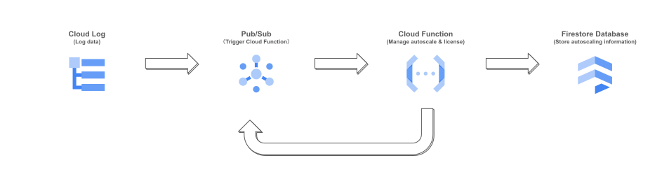

# Guide: Cloud Functions (Cloud Run Functions)

  > This guide explains the functionality of Cloud Functions and how to control their behavior. While this knowledge is not required to deploy the FortiGate autoscale project, understanding it can help with debugging and customizing behaviors.

Google Cloud Functions (also known as Cloud Run Functions) is a serverless, event-driven computing service that allows you to run code without managing servers. This project uses Cloud Functions for FGT license management, configuration setup, and autoscaling.

The Google Cloud Functions is used by the `fgt_asg_with_function` module. Its script is stored in `/modules/fortigate/fgt_asg_with_function/cloud_function.zip`. You can download the latest file [here](https://github.com/fortinetdev/terraform-google-cloud-modules/blob/main/modules/fortigate/fgt_asg_with_function/cloud_function.zip).


- [Guide: Cloud Functions (Cloud Run Functions)](#guide-cloud-functions-cloud-run-functions)
  - [Workflow](#workflow)
  - [Customize Function Behaviors](#customize-function-behaviors)
    - [Cloud Functions Service](#cloud-functions-service)
    - [Logging](#logging)


## Workflow


Google Cloud Functions is an event-driven computing service, typically triggered by the creation or deletion of FortiGate (FGT) instances.

When an FGT instance is created or deleted, a corresponding [log](https://console.cloud.google.com/logs/query) is generated. This Terraform project includes a [log router sink](https://console.cloud.google.com/logs/router) that continuously monitors Google Cloud Logs. When the log router sink detects an FGT creation or deletion event, it forwards a message to a [Pub/Sub topic](https://console.cloud.google.com/cloudpubsub/topic/list), which in turn triggers the execution of [Cloud Functions](https://console.cloud.google.com/run).

Cloud Functions operate as multi-threaded Python scripts, with each event triggering a separate thread. These scripts handle tasks such as FGT license management, configuration setup, and autoscaling. Cloud Functions interact with the [Firestroe database](https://console.cloud.google.com/firestore/databases) for data storage and retrieval. If a task cannot be completed within the current thread, the Cloud Function thread saves the task details to Firestore and publishes a message to the pub/sub topic. This triggers another Cloud Function thread to process the remaining tasks, ensuring seamless execution and scalability.

## Customize Function Behaviors

All examples (e.g., `"fortinetdev/cloud-modules/google//examples/autoscale_fgt_as_hub"`) and modules (e.g., `"fortinetdev/cloud-modules/google//modules/fortigate/fgt_asg_with_function"`)  that rely on the Cloud Function include an input variable `cloud_function`, which defines its behavior.


### Cloud Functions Service

Cloud Functions are running service with configurable parameters defined in `cloud_function->service_config`. Every example provides default values for `cloud_function->service_config`,  which are typically sufficient for its specific use case. However, you can adjust these values to better fit your needs.

The following parameters can be customized:
- `max_instance_count` – The maximum number of function instances that can run concurrently.
- `max_instance_request_concurrency` – The maximum number of concurrent requests a single Cloud Function instance can handle.
- `available_cpu` – The number of CPUs allocated per function instance.
- `available_memory` – The amount of memory available for each function instance.
- `timeout_seconds` – The maximum execution time for the function.

**Example Configuration:**
```hcl
cloud_function = {
  # <other parameters...>
  service_config = {
    max_instance_count               = 1    # Maximum number of concurrent function instances.
    max_instance_request_concurrency = 10   # Maximum concurrent requests handled per instance.
    available_cpu                    = "1"  # The number of CPUs used in a single container instance.
    available_memory                 = "1G" # The amount of memory available for a function.
    timeout_seconds                  = 420  # The function execution timeout.
  }
}
```

### Logging

This project categorizes logs into five levels: `"ERROR"`, `"WARN"`, `"INFO"`, `"DEBUG"`, and `"TRACE"`.

**Type of Log**
- `"ERROR"`: A critical issue occurred in the Cloud Function that may impact functionality.
- `"WARN"`: Unexpected behavior detected, but functionality remains unaffected.
- `"INFO"`: General project progress updates, such as Cloud Function execution start and completion.
- `"DEBUG"`: Debugging information, which may contain sensitive data.
- `"TRACE"`: Highly detailed logs, capturing all available information, including sensitive data.

You can view logs in the [Log Explorer](https://console.cloud.google.com/logs/query).

**Configuring Log Levels**

The logging level is controlled by the `cloud_function->logging_level` parameter.
- `"NONE"`: No logs recorded.
- `"ERROR"`: Logs only "ERROR" events.
- `"WARN"`: Logs "WARN" and "ERROR" events.
- `"INFO"`: Logs "INFO", "WARN", and "ERROR" events.
- `"DEBUG"`: Logs "DEBUG", "INFO", "WARN", and ERROR events.
- `"TRACE"`: Logs all events ("ERROR", "WARN", "INFO", "DEBUG", and "TRACE").

**Example Configuration:**
```hcl
cloud_function = {
  # <other parameters...>
  service_config = {
    logging_level = "TRACE"     # Verbosity of logs. Possible values include "NONE", "ERROR", "WARN", "INFO", "DEBUG", and "TRACE". You can find logs in Google Cloud Logs Explorer.
  }
}
```


